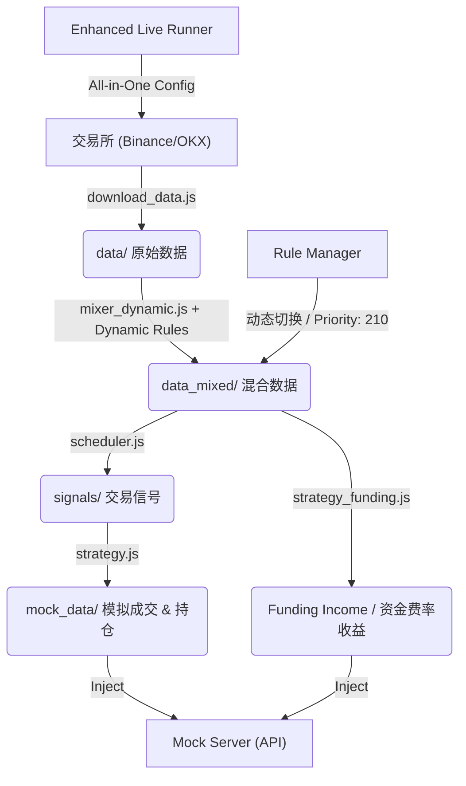

# Replay Bot Service

## 简介 (Introduction)

Replay Bot 是一个用于模拟和回放对冲策略（Hedging Strategy）的自动化服务。它的核心目标是基于真实或模拟的市场数据，生成策略信号，执行模拟交易，并将生成的委托（Orders）和持仓（Positions）实时注入到 Mock Server 中，以便前端界面进行展示和调试。

本项目支持“配置驱动”（Config-Driven）的开发模式，允许用户通过 JSON 配置文件定义对冲组合、风险阈值、资金费率策略以及数据混合规则。

## 🆕 核心特性 (Core Features)

### 动态规则系统 (Dynamic Rule System)
- **实时规则切换**：支持运行时动态切换 Mixer 规则，无需重启服务
- **分钟级增量处理**：基于 **Incremental Engine**，实现 60s/tick 的极低延时流水线（首扫 + 差异化追加）
- **高优先级抢占**：引入 210 优先级权重，确保手动控制指令能绝对覆盖历史配置
- **智能规则管理**：自动检测当前时间段应使用的规则，支持 Upsert 模式更新已有 ID

### 规则控制工具 (Rule Manager)
```bash
# 查看所有可用规则
node rule_manager.js list

# 测试规则效果（不实际切换）
node rule_manager.js test seg_A

# 切换到指定规则（持续30分钟，自动通过 210 优先级抢占当前市场控制权）
node rule_manager.js switch seg_A 30

# 撤销所有干扰，回归真实市场（高优先级 default 模式）
node rule_manager.js switch default 60

# 查看当前规则状态
node rule_manager.js status
```

### 可用规则段 (Available Segments)
- **seg_A**: 提升资金费并轻微抬升相对价差（+0.15%）
- **seg_B**: 压低相对价差（-0.10%，更激进）
- **seg_C**: 极端价差场景（-0.50%，测试用）

## 核心架构 (Architecture)

### 数据流向 (Data Flow)



### 核心组件 (Components)

1.  **数据获取 (Data Acquisition)**
    *   脚本: `download_data.js`
    *   功能: 根据 Hedge Config 定义的交易对，**增量下载** Binance 和 OKX 的 K 线与资金费率数据。
    *   输出: `data/*.json`
    *   特性: 支持增量下载，自动合并去重

2.  **数据混合 (Data Mixer)**
    *   脚本: `mixer_dynamic.js` (增强版)
    *   功能: 应用**动态规则**（实时切换的价格偏移、资金费率调整）来修改原始数据，创造特定的测试场景。
    *   输出: `data_mixed/<mix_name>/*.json`
    *   特性: 支持运行时规则切换，详细变更日志

3.  **信号生成 (Signal Scheduler)**
    *   脚本: `scheduler.js`
    *   功能: 读取混合后的市场数据，计算价差（Spread），根据阈值生成开仓/平仓信号。
    *   输出: `signals/signals_TRX.json` (统一信号池), `signals/indexed_history_TRX.json` (全量历史)
    *   特性: 容忍度匹配，支持多腿对冲，统一 HEDGE/FUNDING 信号格式

4.  **策略执行 (Strategy Execution)**
    *   脚本: `strategy.js` (价差套利) & `strategy_funding.js` (资金费率套利)
    *   功能: 读取统一信号文件，模拟撮合，生成详细的成交记录和持仓快照。**自动检测 Mock Server 状态**，若在线则注入，若离线则仅生成本地文件。
    *   输出: `mock_data/*.json` -> (Optional) HTTP POST to Mock Server
    *   特性: 智能预检 (Offline Mode)，配置驱动，支持资金费率收益计算

5.  **实时编排 (Live Orchestrator)**
    *   脚本: `live_runner_enhanced.js` (增强版)
    *   功能: **精确60秒循环**运行完整流程，支持动态规则检测和切换。
    *   特性: 容错机制，规则历史追踪，优雅关闭

## 快速开始 (Quick Start)

### 1. 启动全能版实时循环 (Unified Mode - 推荐)

```bash
# 在 service/replay-bot 目录下，使用 All-in-One 配置文件管全部
node live_runner_enhanced.js --strategy=config/strategy/demo_strategy_all_in_one.json
```

系统会自动：
- 每60秒增量下载最新数据
- **记忆化更新**：基于 Checkpoint 仅处理新到行情，极速计算
- 应用当前时间段的动态规则（支持高优先级手动覆盖）
- 在同一文件中管理对冲资产定义与策略信号阈值
- 记录完整的规则变更历史

### 2. 环境一键清理

在开始新的一轮压力测试前，建议清空信号和收益缓存：

```bash
node clean_data.js
```
*此操作会重置信号 ID、收益金额和持仓状态，使系统回到“白纸”状态。*

### 3. 动态规则控制

在系统运行期间，您可以随时切换规则：

```bash
# 切换到温和价差场景（30分钟）
node rule_manager.js switch seg_A 30

# 切换到激进价差场景（60分钟）
node rule_manager.js switch seg_B 60

# 切换到极端测试场景（15分钟）
node rule_manager.js switch seg_C 15

# 查看当前规则状态
node rule_manager.js status
```

### 3. 手动分步运行 (Manual Execution)

如果您需要调试某个具体步骤：

**Step 1: 下载数据**
```bash
node download_data.js --config=config/hedge/demo_hedge_trx_binance_okx.json
```

**Step 2: 使用动态规则混合数据**
```bash
node mixer_dynamic.js
# 会自动检测并应用当前时间段的活跃规则
```

**Step 3: 生成信号**
```bash
node scheduler.js --config=config/hedge/demo_hedge_trx_binance_okx.json --data-dir=data_mixed/demo_mix_trx_okx_binance
```

**Step 4: 执行策略 & 注入数据**
```bash
node strategy.js --config=config/strategy/demo_strategy_funding_trx.json
```

**Step 5: 计算资金费率收益**
```bash
node strategy_funding.js --config=config/strategy/demo_strategy_funding_trx.json --data-dir=data_mixed/demo_mix_trx_okx_binance
```

## 配置文件说明 (Configuration)

所有的配置文件都位于 `config/` 目录下。

### 1. Hedge Config (`config/hedge/`)
定义对冲组合的基础信息和信号阈值。
*   示例: `demo_hedge_trx_binance_okx.json`
*   关键字段:
    *   `legs`: 包含的交易所和交易对 (如 Binance TRXUSDT + OKX TRX-USDT-SWAP)。
    *   `spread_pct_thresholds`: 开平仓的价差阈值。
    *   `outputs`: 输出路径配置及 `inject_to_mock_server` 开关。

### 2. Strategy Config (`config/strategy/`)
定义资金管理和具体的执行参数。
*   示例: `demo_strategy_funding_trx.json`
*   关键字段:
    *   `hedge_config_path`: 关联的 Hedge Config。
    *   `initial_balance`: 初始资金。
    *   `leverage`: 杠杆倍数。
    *   `risk_limits`: 风险控制参数。

### 3. Mixer Config (`config/mixer/`)
定义数据篡改/混合规则，**支持动态切换**。
*   示例: `demo_mix_trx_okx_binance.json`
*   关键字段:
    *   `segments`: 时间段定义，每个段有独立的规则集。
    *   `ops`: 规则操作（价格偏移、资金费率缩放、噪声添加等）。
    *   `priority`: 规则优先级（高优先级会覆盖低优先级）。

## Mock Server 集成

本服务通过 HTTP 请求与 Mock Server 通信。
*   **Base URL**: `http://localhost:3000` (默认)
*   **Endpoints**:
    *   `POST /mock/order`: 注入委托/成交。
    *   `POST /mock/position`: 注入持仓快照。
    *   `POST /mock/income`: (计划中) 注入资金流水。

系统会在运行 `strategy.js` 时自动进行连接预检：
*   **在线模式**: 若 Mock Server (port 3000) 可达，则实时注入 Order 和 Position 数据。
*   **离线模式**: 若 Mock Server 未启动，系统会自动跳过注入步骤，仅在 `mock_data/` 生成 JSON 文件，**流程不会中断**。

## 目录结构 (Directory Structure)

```
replay-bot/
├── config/                    # 配置文件 (Hedge, Mixer, Strategy)
│   ├── hedge/                # 对冲组合配置
│   ├── mixer/                # 数据混合规则
│   └── strategy/             # 策略参数配置
├── data/                     # 原始下载数据 (勿手改)
├── data_mixed/               # 混合处理后的数据 (策略输入源)
├── mock_data/                # 生成的模拟数据 (Mock Server 注入源)
├── signals/                  # 策略信号 (signals_TRX.json, indexed_history_TRX.json)
├── logs/                     # 运行日志和错误记录
├── mixer_controller.js       # 动态规则管理器
├── mixer_dynamic.js          # 增强版数据混合器
├── rule_manager.js           # 规则切换控制工具
├── live_runner_enhanced.js   # 增强版实时循环
├── download_data.js          # 数据下载脚本
├── scheduler.js              # 信号生成脚本
├── strategy.js               # 策略执行脚本
├── strategy_funding.js       # 资金费率脚本
└── README.md                 # 使用文档
```

## 🆕 新增功能 (New Features)

### 动态规则系统
- ✅ **实时规则切换**：运行时切换不同市场场景
- ✅ **分钟级精确循环**：60秒周期，毫秒级精度
- ✅ **智能错误处理**：失败自动重试，系统稳定性保障
- ✅ **规则历史追踪**：完整记录所有规则变更

### 增强版工具集
- ✅ **规则管理器**：命令行工具，支持规则测试、切换、状态查看
- ✅ **动态混合器**：实时应用当前活跃规则，详细变更日志
- ✅ **增强版实时循环**：支持动态规则检测，支持全量历史回放 (--full-replay)
- ✅ **统一信号系统**：HEDGE 与 FUNDING 策略信号统一存储，支持 strategy 字段区分
- ✅ **离线运行模式**：智能检测 Mock Server 状态，未启动时自动降级为本地生成模式

### 市场场景支持
- **温和场景 (seg_A)**：资金费率+30%，价差+0.15%
- **激进场景 (seg_B)**：价差-0.10%，适合高频交易测试
- **极端场景 (seg_C)**：价差-0.50%，压力测试用

## 高级用法 (Advanced Usage)

### 创建自定义规则
```bash
# 创建新的市场场景
node rule_manager.js create my_rule "自定义温和上涨场景"
```

### 监控运行状态
```bash
# 在另一个终端查看当前状态
node -e "const {MixerController} = require('./mixer_controller'); const c = new MixerController('./config/mixer/demo_mix_trx_okx_binance.json'); console.log(c.getCurrentRule())"
```

### 调试模式
```bash
# 手动运行单个步骤，查看详细日志
DEBUG=1 node mixer_dynamic.js
```

### 常用 CLI 参数

#### live_runner_enhanced.js
- `--full-replay`: 启动全量历史回放模式，从数据源头开始处理
- `--lookback=<minutes>`: 指定调度器的数据回溯窗口（默认 60 分钟，全量回放时建议设大，如 3000）

#### strategy.js / strategy_funding.js
- `--reset`: 清除历史状态和 Checkpoint，重新开始计算
- `--skip-before=<timestamp>`: 跳过指定时间戳之前的信号（用于断点续传或过滤历史）

## 注意事项 (Important Notes)

1. **时间同步**：确保系统时间准确，规则切换依赖时间判断
2. **Mock Server**：运行前必须启动 Mock Server (port 3000)
3. **数据连续性**：建议保持系统持续运行，避免数据断层
4. **规则冲突**：高优先级规则会覆盖低优先级规则
5. **性能考虑**：每分钟循环适合大多数场景，如需更高频率可调整配置

## 故障排除 (Troubleshooting)

### 常见问题
1. **规则不生效**：检查系统时间是否在规则时间段内
2. **数据不更新**：确认网络连接和API限流
3. **注入失败**：检查 Mock Server 是否正常运行
4. **周期超时**：查看是否有脚本执行过慢，考虑优化或增加间隔

### 日志文件
- 错误日志：`logs/error_*.json`
- 规则历史：`config/mixer/*_history.json`
- 运行日志：各脚本控制台输出

---

**🎯 现在您拥有了一个完整的、支持动态规则切换的分钟级对冲策略回放系统！**