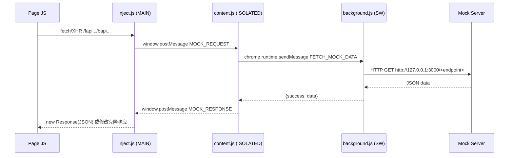
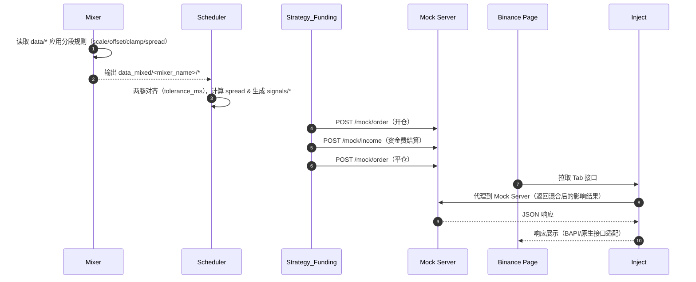

# 工程说明（Mock Trading & Replay Bot）

## 项目目标
- 在真实历史数据基础上进行“可控场景放大/缩小”，构造便于触发对冲信号的混合数据。
- 通过 Mock Server 注入订单与资金流水，在交易所页面底部 Tab（当前委托、历史委托、历史成交、资金流水）上真实展示。
- 打通端到端复盘流水线：下载/采集 → 混合 → 对齐/信号 → 策略执行 → 注入展示 → 审计。

## 设计意图
- 配置驱动而非硬编码：对冲对象、策略参数、数据混合规则均以模板/配置注入。
- 混合器分段规则：按中国时区（UTC+8）控制资金费率与价差，精准塑形场景。
- 兼容多交易所与内部 BAPI：拦截层统一代理/适配，最小侵入页面逻辑。

## 模块结构
- Chrome Extension（Manifest V3）
  - `inject.js`（MAIN world，文档起始注入）：拦截 `fetch/XHR/WebSocket`，代理到 Mock Server，适配 BAPI 响应；心跳日志与捕获上报。路径：`mock_plugin/chrome-extension/inject.js`
  - `content.js`（ISOLATED world）：桥接 `inject.js` 与后台，负责 `postMessage → chrome.runtime.sendMessage`。路径：`mock_plugin/chrome-extension/content.js`
  - `background.js`（Service Worker）：代理到 `http://127.0.0.1:3000`；页面 `loading` 阶段编程式注入 `inject.js`。路径：`mock_plugin/chrome-extension/background.js`
  - Manifest 配置：`world: MAIN`、`run_at: document_start`，允许 `host_permissions`。路径：`mock_plugin/chrome-extension/manifest.json`
- Mock Server（Fastify）
  - 兼容 Binance 路由：`/fapi/v1/userTrades`、`/fapi/v1/allOrders`、`/fapi/v2/positionRisk`、`/fapi/v2/balance`、`/fapi/v1/income`
  - 注入入口：`POST /mock/order`、`POST /mock/income`、捕获归档：`POST /capture`
  - 数据源：内存 Map + DB 适配，端点适配由 `adapters/binance.js` 完成。路径：`mock_plugin/service/mock-server/index.js`
- Replay Bot（复盘流水线）
  - 下载与采集：`download_data.js`、`fetch_rules.js`→ 输出 `data/` 与 `config/`
  - 时间对齐与信号：`scheduler.js` → 输出 `signals/`
  - 策略执行（成交/仓位）：`strategy.js` → 输出 `mock_data/`
  - 资金费率套利：`strategy_funding.js` → 注入订单与资金流水到 Mock Server
  - **🆕 工程改进 (2026-01-25)**：
    - `package.json` - 项目规范化、npm 脚本
    - `config/env.js` - 环境配置加载器
    - `lib/logger.js` - JSON 结构化日志
    - `lib/validator.js` - 配置文件验证
    - `test/validator.test.js` - 基础测试 (9/9 passed)
    - 详见：`tasks/completed/replay_bot_improvements.md`
- Mixer（数据混合器，提示词工程）
  - 规则说明：`prompt_mixer_rules.md`
  - 计划模板：`prompt_mixer_plan_template.md`
  - 审计模板：`prompt_mixer_audit_template.md`
  - 输出约定：`data_mixed/<mixer_name>/...`
- 工程提示词与模板（Tasks）
  - 调度/策略/下载提示词：`prompt_scheduler_config.md`、`prompt_strategy_config.md`、`prompt_data_download_config.md`
  - 配置模板：`prompt_hedge_config_template.md`、`prompt_strategy_config_template.md`
  - 多腿扩展设计：`prompt_multilegs_future.md`
- 调试工具
  - 远程监控页面日志：`service/binance-mock/monitor_console.js`（CDP 连接 9222）

## 数据结构
- Order（Binance 兼容）
  - 关键字段：`orderId,symbol,side,price,origQty,executedQty,cumQuote,status,timeInForce,type,stopPrice,updateTime,avgPrice,positionSide,reduceOnly`
  - 来源：`/fapi/v1/allOrders` 与 `/fapi/v1/openOrders` 适配（`mock_plugin/service/mock-server/index.js:430-445`）
- Trade（用户成交）
  - 关键字段：`id,orderId,symbol,price,qty,quoteQty,commission,commissionAsset,realizedPnl,side,positionSide,maker,buyer,time`
  - 来源：`/fapi/v1/userTrades`（`mock_plugin/service/mock-server/index.js:456-463`）
- Position（仓位风险）
  - Binance：`symbol,positionAmt,entryPrice,markPrice,unRealizedProfit,liquidationPrice,leverage,marginType,isolatedMargin,positionSide,notional,updateTime`
  - 来源：`/fapi/v2/positionRisk`（`mock_plugin/service/mock-server/index.js:448-453`）
- Income（资金流水）
  - 关键字段：`tranId,asset,incomeType,income,time,info,symbol,tradeId`
  - 来源：`/fapi/v1/income` & `POST /mock/income`（`mock_plugin/service/mock-server/index.js:474-506`、`index.js:512-532`）
- Signal（对冲信号）
  - 关键字段：`id,timestamp,timeStr,action,binancePrice,okxPrice,spread,spreadPct`（`mock_plugin/service/replay-bot/scheduler.js:56-69`）
- Mixer Segment（混合段）
  - 关键字段：`id,start_local,end_local,target(metrics: funding|price),ops: [scale,offset,clamp,target_spread_pct,noise],priority`
  - 定义与说明：`prompt_mixer_rules.md`、`prompt_mixer_plan_template.md`

## 消息通讯（拦截桥接）

- 关键拦截点
  - 资金流水：`mock_plugin/chrome-extension/inject.js:418-458`
  - 历史成交：`mock_plugin/chrome-extension/inject.js:373-416`
  - 当前/历史委托：`mock_plugin/chrome-extension/inject.js:311-369`、`inject.js:247-258`
  - 仓位风险：`mock_plugin/chrome-extension/inject.js:229-245`
- WebSocket（账户更新）
  - 截获 `ACCOUNT_UPDATE` 并替换 USDT 余额以保持一致展示（`mock_plugin/chrome-extension/inject.js:552-596`）
- 捕获归档
  - `POST /capture` 保存样本至 `samples/binance/*`（`mock_plugin/service/mock-server/index.js:303-350`）

## 时序（示例）

## 开发规范与流程
- 扩展调试
  - 远程调试端口：Chrome `--remote-debugging-port=9222`；使用 `monitor_console.js` 连接并抓取页面日志。
  - 扩展重载：`chrome://extensions` 中点击 Reload；页面做硬刷新，确保 `inject.js` 在 MAIN world 生效。
  - 日志期望：`[Binance Mock] Initializing hooks...`、`Hooks installed successfully.`、心跳与拦截日志。
- 拦截与安全
  - CSP 友好：通过 `postMessage` + `chrome.runtime.sendMessage` 代理到后台，避免页面直接跨域访问。
  - MAIN/ISOLATED 角色分离：逻辑拦截在 MAIN，网络代理在后台；避免泄露密钥或在页面内存储敏感信息。
- 验证与测试
  - 端点验证：`curl http://127.0.0.1:3000/fapi/v1/income`、`/fapi/v1/userTrades`、`/fapi/v1/allOrders`、`/fapi/v2/positionRisk/binance`
  - 前端验收：Tab 数据是否与注入一致；BAPI 适配结构是否正确。
  - 提示词工程：严格按 `tasks/*.md` 的“验证/出厂条件”逐项验收，不跳步。
- 方法与经验
  - CDP（Chrome DevTools Protocol）用于非侵入式日志与网络观察；避免与 DevTools 交互导致页面状态变化。
  - Mixer 场景构造更接近真实：建议 `scale + clamp` 联用，避免过度极端值；价差目标应用在对齐点上。
  - 失败路径：后台 Service Worker 休眠、MAIN world 注入失败、BAPI 路径变化；均通过编程式注入与心跳监控缓解。

## 用例说明（TRX Demo）
- 目标：在 2025-12-30～2026-01-10 上调 OKX 资金费 30%，在对齐点抬升价差 +0.15%；在 2026-01-10～2026-01-13 上调 50%，压低价差 -0.10%。
- 步骤
  - 下载与采集：运行 `download_data.js`、`fetch_rules.js`（无需当前执行，仅说明）。
  - 混合：依据 `prompt_mixer_plan_template.md` 生成 `data_mixed/demo_mix_trx_okx_binance/*` 与审计报告。
  - 调度：基于 mixed 数据生成 `signals/hedge_signals_TRX.json`。
  - 策略：资金费策略在结算点注入订单与资金费；价差策略生成成交与仓位。
  - 展示：页面底部 Tab 通过拦截呈现注入结果。
- 预期
  - 资金流水 Tab 出现多笔 `FUNDING_FEE`；委托与成交 Tab 对应开/平仓记录；仓位风险与余额与混合场景一致。

## 关联参考（代码定位）
- 资金流水拦截：`mock_plugin/chrome-extension/inject.js:418`
- 历史成交拦截：`mock_plugin/chrome-extension/inject.js:373`
- 当前委托拦截：`mock_plugin/chrome-extension/inject.js:311`
- 仓位风险拦截：`mock_plugin/chrome-extension/inject.js:229`
- 注入订单：`mock_plugin/service/replay-bot/strategy_funding.js:77`
- 注入资金费：`mock_plugin/service/replay-bot/strategy_funding.js:92`
- 捕获归档：`mock_plugin/service/mock-server/index.js:303`
